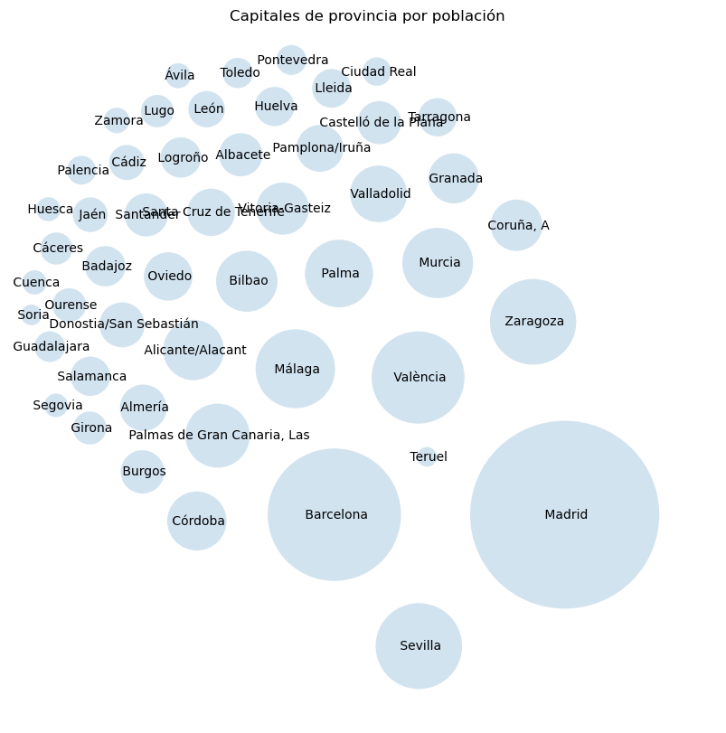
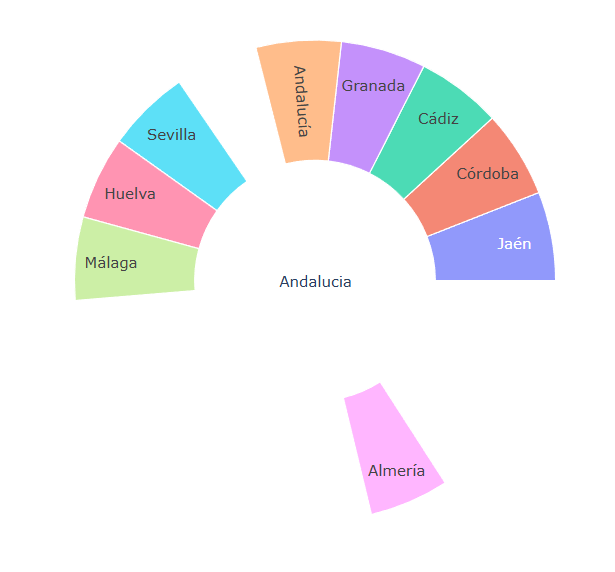
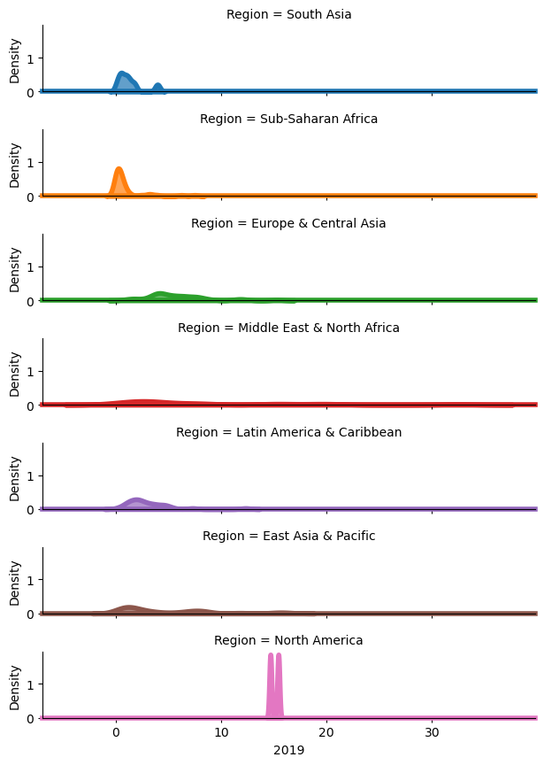

# PEC2 - Visualización de Datos


```python
import pandas as pd
import matplotlib.pyplot as plt
import circlify
import re
from string import digits
import plotly.express as px
import plotly.io as pio
import seaborn as sns
```

## Circle Packing


```python
dataset = pd.read_csv('55199.csv', on_bad_lines='skip', delimiter=";")
dataset = dataset[(dataset['Capital de provincia de residencia'] != 'Total Nacional') & (dataset['Sexo'] == 'Ambos sexos')]
dataset['Total'] = dataset['Total'].str.replace('.','')
table = str.maketrans('', '', digits)
dataset['Capital de provincia de residencia'] = dataset['Capital de provincia de residencia'].str.translate(table)
dataset = dataset.astype({'Total': 'int32'}).sort_values(by=['Total'])

# compute circle positions
circles = circlify.circlify(
    dataset['Total'].tolist(),
    show_enclosure=False,
    target_enclosure=circlify.Circle(x=0, y=0, r=1)
)

# reverse the order of the circles to match the order of data
#circles = circles[::-1]

# Create just a figure and only one subplot
fig, ax = plt.subplots(figsize=(10, 10))

# Title
ax.set_title('Capitales de provincia por población')

# Remove axes
ax.axis('off')

# Find axis boundaries
lim = max(
    max(
        abs(circle.x) + circle.r,
        abs(circle.y) + circle.r,
    )
    for circle in circles
)
plt.xlim(-lim, lim)
plt.ylim(-lim, lim)

# list of labels
labels = dataset['Capital de provincia de residencia']

# print circles
for circle, label in zip(circles, labels):
    x, y, r = circle
    ax.add_patch(plt.Circle((x, y), r*0.7, alpha=0.2, linewidth=2))
    plt.annotate(
        label,
        (x, y),
        va='center',
        ha='center'
    )
```


    

    


## Sunburst


```python
dataset = pd.read_csv('ieca_export.txt', on_bad_lines='skip', delimiter=";")
dataset = dataset[(dataset['Anual'] == 2023) & (dataset['Sexo'] != 'Ambos sexos')]
dataset['Valor'] = dataset['Valor'].str.replace(',','.')
dataset['CCAA']='Andalucia'
dataset = dataset._append({'Valor' : 1, "CCAA" : "", "Territorio" : "Andalucia"}, ignore_index=True)
dataset = dataset.astype({'Valor': 'float32'}).sort_values(by=['Valor']).to_dict(orient='list')

fig = px.sunburst(
    dataset,
    names='Territorio',
    parents='CCAA',
    values='Valor',
)
fig.show()
```





## Ridgeline


```python
dataset = pd.read_csv('CO2_emission.csv', on_bad_lines='skip', delimiter=",").dropna()

rp = sns.FacetGrid(dataset, row="Region", hue="Region", aspect=5, height=1.25) 
  
rp.map(sns.kdeplot, '2019', clip_on=False, 
       fill=True, alpha=0.7, lw=4, bw_method=.2) 
  
rp.map(plt.axhline, y=0, lw=4, clip_on=False)
```

    C:\Users\Juanka\anaconda3\Lib\site-packages\seaborn\axisgrid.py:118: UserWarning:
    
    The figure layout has changed to tight
    
    C:\Users\Juanka\anaconda3\Lib\site-packages\seaborn\axisgrid.py:118: UserWarning:
    
    The figure layout has changed to tight
    
    


    <seaborn.axisgrid.FacetGrid at 0x18b6d9bf410>


    

    


```python

```
